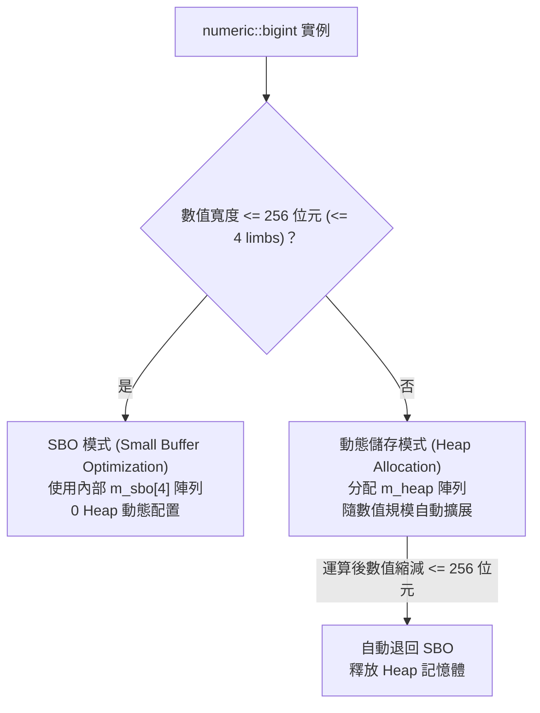

# numeric::bigint 類別

表示任意精度的有符號整數（Arbitrary-Precision Signed Integer）。

## 命名空間與標頭檔
- **命名空間 (Namespace)**: `numeric`
- **標頭檔 (Header)**: `<numeric/BigInt.hpp>`
- **模組 (Module)**: `import bigint;` (C++20+)
- **基礎架構**: 繼承自 `detail::BigIntConstants<>`

---

## 語法宣告 (Syntax)

```cpp
namespace numeric {
    class bigint : public detail::BigIntConstants<>;
}
```

---

## 類別摘要 (Summary)

`numeric::bigint` 提供在理論上僅受可用記憶體限制的任意精度整數運算。類別設計以效能、直覺性與相容性為核心：
- **256-bit Small Buffer Optimization (SBO)**：於類別內部常駐 4 個 64-bit limbs 緩衝區。數值介於 $[-2^{256}+1, 2^{256}-1]$ 範圍內時，**享有 0 次 Heap 動態記憶體配置**。
- **高階演算法與無鎖暫存池 (`ScratchArena`)**：
  - **乘法**：支援學校乘法與 **Karatsuba 分治乘法** ($O(N^{1.585})$)。
  - **雙階除法派發**：中小型整數（$< 128$ limbs）採用 **Knuth Algorithm D**；大型整數（$\ge 128$ limbs / 8,192 bits）自動分派至 **Burnikel-Ziegler $D_{2n,n} / D_{3n,2n}$** 分治演算法 ($O(M(N)\log N)$)。
  - **Thread-Local ScratchArena**：大數運算遞迴深度內達成 **0 次 Heap 動態配置**。
- **Direct-Result 與 Move-Reuse 零拷貝運算子**：二元運算子提供 4-overload 矩陣，常數參考直接建構結果，右值運算元就地重用緩衝區。
- **無縫整數混算**：支援與所有 C++ 原生整數型態（`int8_t` ~ `int64_t`、`uint8_t` ~ `uint64_t`、`long`、`char` 等）無縫進行混合四則運算、位元運算與比較。
- **標準二補數語意**：位元運算子（`&`, `|`, `^`, `~`, `<<`, `>>`）模擬標準二補數無限符號延伸（Two's Complement sign extension），其行為與原生有符號整數高度一致。
- **全編譯期求值 (`constexpr`) 支援**：在 C++20 及以上標準環境下，建構子、四則運算、位元運算與比較皆完整標註為 `constexpr`。

---

## 記憶體配置與內部模型 (Internal Architecture)



### 1. SBO 狀態轉移
- **晉升 Heap**：當運算（如加法進位或大數相乘）使數值超過 256 位元（需 5 個或更多 limbs）時，底層儲存結構自動於 Heap 分配陣列，並將資料轉移至動態緩衝區。
- **回縮 SBO**：當運算（如減法借位、除法或位移）使數值回縮至 256 位元（$\le 4$ limbs）以內時，`bigint` 自動將資料搬回內建 SBO 緩衝區，並立刻釋放動態 Heap 記憶體，以維持快取局部性。


### 2. 零與符號規則
- 數值 `0` 的符號規範為 `0`，`limb_count()` 規範為 `0`。
- 正數符號規範為 `1`，負數符號規範為 `-1`。
- 內部正規化保證最高位 limb 恆不為零（除非整個數值為 0）。

---

## 成員分類清單 (Members)

| 成員類別 | 說明文件 | 主要包含項目 |
| :--- | :--- | :--- |
| **常數代理** | [靜態解析與常數](parsing.md) | `zero`, `one`, `operator()` |
| **建構函式** | [建構函式全覽](constructors.md) | 預設建構子、原生型別、泛型整數、字串視圖、`std::bitset` |
| **狀態檢測** | [屬性與狀態方法](properties.md) | `is_sbo`, `is_small`, `is_zero`, `sign`, `limb_count`, `limbs`, `storage` |
| **型別轉換** | [轉換與序列化](conversions.md) | `operator bool`, `int64_t`, `double`, `to_string`, `to_binary_string`, `to_bitset` |
| **運算子重載** | [運算子全集](operators.md) | `+`, `-`, `*`, `/`, `%`, 位元運算、位移、比較、邏輯、串流輸出 |
| **靜態方法** | [靜態解析與常數](parsing.md) | `from_string`, `from_binary_string` |

---

## 簡易示範 (Example)

```cpp
#include <numeric/BigInt.hpp>
#include <iostream>

int main() {
    // 預設建構 (值為 0)
    numeric::bigint zero_val;
    std::cout << "Zero: " << zero_val << ", is_sbo: " << zero_val.is_sbo() << "\n";

    // 透過十進位字串建構 256 位元以內的大整數
    numeric::bigint large("115792089237316195423570985008687907853269984665640564039457584007913129639935"); // 2^256 - 1
    std::cout << "Large: " << large << ", SBO: " << large.is_sbo() << "\n";

    // 超出 256 位元自動轉移至 Heap
    numeric::bigint huge = large * 2;
    std::cout << "Huge: " << huge << ", SBO: " << huge.is_sbo() << "\n";

    // 縮減回 256 位元自動退回 SBO
    huge /= 2;
    std::cout << "Shrunk: " << huge << ", SBO: " << huge.is_sbo() << "\n";

    return 0;
}
```

---

## 注意事項 (Notes)

> [!TIP]
> 絕大多數密碼學金鑰、UUID、時間戳記或 128 位元運算皆可完全限制在 SBO 內部完成，具備極高的執行效能與零記憶體碎片優勢。

> [!NOTE]
> `numeric::bigint` 符合 RAII 原則，完全負責自身內部 Heap 記憶體的配置與釋放，無需使用者手動介入。
