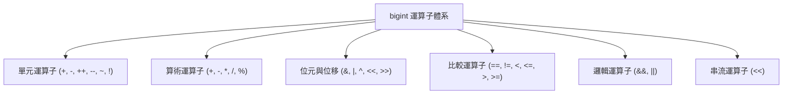

# bigint 運算子重載 (Operator Overloads)

介紹 `numeric::bigint` 所支援的完整運算子重載集合，涵蓋單元運算子、算術運算子、複合賦值、位元運算、泛型位移、關係比較、邏輯混算與 I/O 串流輸出。

## 命名空間與標頭檔
- **命名空間**: `numeric`
- **標頭檔**: `<numeric/BigInt.hpp>`

---

## 運算子分類總覽 (Operators Overview)



---

## 詳細說明

### 1. 單元運算子 (Unary Operators)

#### 語法
```cpp
NUMERIC_CONSTEXPR_20 bigint  operator+() const;
NUMERIC_CONSTEXPR_20 bigint  operator-() const;
NUMERIC_CONSTEXPR_20 bigint& operator++();    // 前置遞增
NUMERIC_CONSTEXPR_20 bigint  operator++(int); // 後置遞增
NUMERIC_CONSTEXPR_20 bigint& operator--();    // 前置遞減
NUMERIC_CONSTEXPR_20 bigint  operator--(int); // 後置遞減
NUMERIC_CONSTEXPR_20 bigint  operator~() const;
NUMERIC_CONSTEXPR_20 bool    operator!() const noexcept;
```

#### 運算行為與備註
- **`operator+()`**：傳回自身複本。
- **`operator-()`**：正負號反轉（若為 0 則維持 0）。
- **`operator++` / `operator--`**：加 1 或減 1。前置版本回傳自身參考（效能較佳），後置版本回傳遞增/遞減前之舊值複本。
- **`operator~()`**：位元 NOT 運算。嚴格遵守無限位元二補數語意，數值上恆等於 `~a = -a - 1`。
- **`operator!()`**：邏輯反相。若數值等於 0 回傳 `true`，否則回傳 `false`。

#### 範例
```cpp
numeric::bigint a = 5;
std::cout << -a   << "\n"; // 輸出: -5
std::cout << ~a   << "\n"; // 輸出: -6 (~5 = -5 - 1)
std::cout << ++a  << "\n"; // 輸出: 6
std::cout << (!a) << "\n"; // 輸出: 0 (false)
```

---

### 2. 算術二元運算子與複合賦值 (Arithmetic & Compound Assignment)

#### 語法
```cpp
// 二元算術 (完整 4-Overload 矩陣：Direct-Result 與右值就地重用)
friend NUMERIC_CONSTEXPR_20 bigint operator+(const bigint& lhs, const bigint& rhs);
friend NUMERIC_CONSTEXPR_20 bigint operator+(bigint&& lhs, const bigint& rhs);
friend NUMERIC_CONSTEXPR_20 bigint operator+(const bigint& lhs, bigint&& rhs);
friend NUMERIC_CONSTEXPR_20 bigint operator+(bigint&& lhs, bigint&& rhs);

friend NUMERIC_CONSTEXPR_20 bigint operator-(const bigint& lhs, const bigint& rhs);
friend NUMERIC_CONSTEXPR_20 bigint operator-(bigint&& lhs, const bigint& rhs);
friend NUMERIC_CONSTEXPR_20 bigint operator-(bigint&& lhs, bigint&& rhs);

friend NUMERIC_CONSTEXPR_20 bigint operator*(const bigint& lhs, const bigint& rhs);
friend NUMERIC_CONSTEXPR_20 bigint operator/(const bigint& lhs, const bigint& rhs);
friend NUMERIC_CONSTEXPR_20 bigint operator%(const bigint& lhs, const bigint& rhs);

// 複合賦值
NUMERIC_CONSTEXPR_20 bigint& operator+=(const bigint& rhs);
NUMERIC_CONSTEXPR_20 bigint& operator-=(const bigint& rhs);
NUMERIC_CONSTEXPR_20 bigint& operator*=(const bigint& rhs);
NUMERIC_CONSTEXPR_20 bigint& operator/=(const bigint& rhs);
NUMERIC_CONSTEXPR_20 bigint& operator%=(const bigint& rhs);
```

#### 運算法則與硬體加速
- **加法與減法** ($O(N)$)：
  - **Direct-Result 語意與零深拷貝 (Zero Copy Overhead)**：`operator+` 與 `operator-` 針對左值運算元採用 `(const bigint& lhs, const bigint& rhs)`，運算結果直接寫入回傳物件，徹底消除傳統以值傳遞（Pass-by-value）時非必要的大數 Heap 深層拷貝。在大數加減法實測中獲得 **2.3x ~ 2.6x** 的顯著效能飛躍。
  - **右值移動重用 (Rvalue Move Optimization)**：當運算元包含暫時物件（如 `bigint&&` 或連續運算 `a + b + c`）時，自動觸發移動重載，就地重用已配置之內部堆積緩衝區，達成連續鏈式運算 0 額外記憶體配置。
  - **硬體指令級加速 (Hardware Intrinsics)**：核心採用 `adc64` 與 `sbb64`，於 MSVC 啟用 `_addcarry_u64` / `_subborrow_u64`，於 GCC/Clang 啟用 `__builtin_addcll` / `__builtin_subcll`，利用 CPU Carry Flag 進行單週期連鎖進借位。
  - **4-Limb SBO 加減法對稱暫存器級快速路徑 (`add_unsigned_sbo4` / `sub_unsigned_sbo4`)**：針對 $\le 256$ 位元之 SBO 內部 4 個 limbs 實施完全無分支展開（Unrolled Loop），消除迴圈跳轉開銷，完全於 CPU 暫存器中以單週期 carry/borrow chain 執行。加法與減法分別取得 **~5.0 ns 與 ~5.1 ns** 的對稱極致延遲，大幅超越 .NET 10 Native AOT（~19 ns）與 Python（~41 ns）。
  - **早期終止機制 (Early-exit Propagation)**：當殘留進位/借位歸零且較短運算元已耗盡時，立即退出運算迴圈並執行批次記憶體拷貝，大幅縮短不對稱位元加減時間。
  - **自我別名安全 (Self-Aliasing Safety)**：底層演算法（如 `BigIntCore::add_signed`、`BigIntCore::sub_signed`）全面通過別名防護檢測，即使運算元位址重疊（例如 `a += a`），亦能保證計算正確性。
- **乘法 (三層階梯式演算法架構)**：
  - **第 1 階：Schoolbook 乘法 ($N \le 16$ limbs / 1024 bits, $O(N^2)$)**：小規模乘法採用高度內聯與向量化之學校乘法。當運算元長度總和 $\le$ SBO 容量時（例如 128 位元 $\times$ 128 位元），直接在棧上 SBO 緩衝區就地計算，**達成 0 次 Heap 分配與 ~12 ns 延遲**。
  - **第 2 階：Karatsuba 分治乘法 ($16 < N \le 64$ limbs / 1024 ~ 4096 bits, $O(N^{\log_2 3}) \approx O(N^{1.585})$)**：中型整數自動啟用 Karatsuba 乘法，透過 $(A_1 + A_0)(B_1 + B_0)$ 將 4 次子乘法縮減為 3 次。
  - **第 3 階：Toom-Cook 3 (Toom-3) 分治乘法 ($N > 64$ limbs / > 4096 bits, $O(N^{\log_3 5}) \approx O(N^{1.465})$)**：針對 4,096 位元以上的大型數值，將運算元分割為 3 項多項式，於 $0, 1, -1, -2, \infty$ 五個點進行插值求值與高精度矩陣逆轉換，運算複雜度由 $N^{1.585}$ 進一步壓低至 $N^{1.465}$。
  - **Thread-Local 刮痕池 (`ScratchArena`)**：Karatsuba 與 Toom-3 的多層遞迴臨時緩衝區由線程局部無鎖的 RAII `ScratchArena` 管理，整個乘法運算生命週期內達成 **0 次 Heap 動態分配與釋放**。
- **除法與取模**：
  - **雙階派發架構 (Two-Tier Division Architecture)**：
    - **中小型運算元 ($< 128$ limbs / 8,192 bits)**：採用改良版 **Knuth Algorithm D** 規格化長除法。對於 16,384 位元以內的運算元，正規化工作陣列完全配置於棧上（`stack_scratch[512]`），達成 0 次 Heap 動態配置。
    - **大型運算元 ($\ge 128$ limbs / 8,192 bits)**：自動切換至 **Burnikel-Ziegler $D_{2n, n}$ / $D_{3n, 2n}$ 分治除法**。透過將除數與被除數依據動態區塊長度 $n$ 與補位 $\sigma = n_{\text{bits}} - v_{\text{bits}}$ 進行高位區塊正規化，並遞迴調用快速長乘法，將長除法複雜度由傳統 $O(N^2)$ 降低至 **$O(M(N) \log N)$**。64K-bit 除法速度達到 **2.59x 加速**（延遲由 306.45 µs 降低至 **118.22 µs**）。
  - **商餘獨立求值 (Decoupled Quotient/Remainder)**：內部介面解耦為 `div_q_signed`、`div_r_signed` 與 `div_qr_signed`。當執行除法（`a / b` 或 `a /= b`）時，完全不配置亦不處理餘數陣列；當執行取模（`a % b` 或 `a %= b`）時，完全跳過商數陣列之填充與正規化，大幅節省記憶體頻寬。

#### 例外狀況
- `std::invalid_argument`：當除數或取模右運算元 `rhs == 0`（除以零）時拋出。

#### 注意事項
> [!WARNING]
> 除法與取模遵守 C++11 截斷除法標準規範（向零捨入 Truncated Division）：商數的正負符號取決於兩運算元之符號積；餘數的符號恆與被除數相同，且保證 `(a / b) * b + (a % b) == a`。

---

### 3. 位元運算子 (Bitwise Operators)

#### 語法
```cpp
// 二元位元運算（4-overload 矩陣：Direct-Result 與 Move-Reuse）
friend NUMERIC_CONSTEXPR_20 bigint operator&(const bigint& lhs, const bigint& rhs);
friend NUMERIC_CONSTEXPR_20 bigint operator&(bigint&& lhs, const bigint& rhs);
friend NUMERIC_CONSTEXPR_20 bigint operator&(const bigint& lhs, bigint&& rhs);
friend NUMERIC_CONSTEXPR_20 bigint operator&(bigint&& lhs, bigint&& rhs);

friend NUMERIC_CONSTEXPR_20 bigint operator|(const bigint& lhs, const bigint& rhs);
friend NUMERIC_CONSTEXPR_20 bigint operator|(bigint&& lhs, const bigint& rhs);
friend NUMERIC_CONSTEXPR_20 bigint operator|(const bigint& lhs, bigint&& rhs);
friend NUMERIC_CONSTEXPR_20 bigint operator|(bigint&& lhs, bigint&& rhs);

friend NUMERIC_CONSTEXPR_20 bigint operator^(const bigint& lhs, const bigint& rhs);
friend NUMERIC_CONSTEXPR_20 bigint operator^(bigint&& lhs, const bigint& rhs);
friend NUMERIC_CONSTEXPR_20 bigint operator^(const bigint& lhs, bigint&& rhs);
friend NUMERIC_CONSTEXPR_20 bigint operator^(bigint&& lhs, bigint&& rhs);

// 複合位元賦值
NUMERIC_CONSTEXPR_20 bigint& operator&=(const bigint& rhs);
NUMERIC_CONSTEXPR_20 bigint& operator|=(const bigint& rhs);
NUMERIC_CONSTEXPR_20 bigint& operator^=(const bigint& rhs);
```

#### 備註
CPP-BigInt 為負整數提供了精準的**無限符號位元二補數抽象語意**：
- 負數在概念上具有無限延伸的符號位元 `...1111`。
- 負數與負數進行 `&`、`|`、`^` 運算結果維持正確的負數二補數規則（如 `(-1) & (-1) == -1`）。
- **零拷貝優化**：針對 `(const&, const&)` 採用 direct-result 直接建構結果緩衝區；當任一運算元為右值（`&&`）時自動重用其底層緩衝區（in-place reuse），避免暫存記憶體配置。

#### 範例
```cpp
numeric::bigint a = 0b1100; // 12
numeric::bigint b = 0b1010; // 10

std::cout << (a & b) << "\n"; // 輸出: 8  (0b1000)
std::cout << (a | b) << "\n"; // 輸出: 14 (0b1110)
std::cout << (a ^ b) << "\n"; // 輸出: 6  (0b0110)
```

---

### 4. 泛型位移運算子 (Generic Shift Operators)

#### 語法
```cpp
template <typename T, typename std::enable_if<std::is_integral<T>::value, int>::type = 0>
NUMERIC_CONSTEXPR_20 bigint& operator<<=(T shift);

template <typename T, typename std::enable_if<std::is_integral<T>::value, int>::type = 0>
NUMERIC_CONSTEXPR_20 bigint& operator>>=(T shift);

template <typename T, typename std::enable_if<std::is_integral<T>::value, int>::type = 0>
friend NUMERIC_CONSTEXPR_20 bigint operator<<(const bigint& lhs, T shift);

template <typename T, typename std::enable_if<std::is_integral<T>::value, int>::type = 0>
friend NUMERIC_CONSTEXPR_20 bigint operator<<(bigint&& lhs, T shift);

template <typename T, typename std::enable_if<std::is_integral<T>::value, int>::type = 0>
friend NUMERIC_CONSTEXPR_20 bigint operator>>(const bigint& lhs, T shift);

template <typename T, typename std::enable_if<std::is_integral<T>::value, int>::type = 0>
friend NUMERIC_CONSTEXPR_20 bigint operator>>(bigint&& lhs, T shift);
```

#### 型別參數
- `typename T`: 任意原生整數型別（如 `int`, `unsigned int`, `size_t`, `int64_t` 等）。

#### 參數
- `shift`: 位移位元數（必須 $\ge 0$）。

#### 運算行為
- **`<<` (左移)**：相當於乘上 $2^{\text{shift}}$。
- **`>>` (右移)**：**算術右移（Arithmetic Shift）**。
  - 對正數進行右移相當於向下整除 $2^{\text{shift}}$。
  - 對負數進行右移遵循二補數算術右移（向負無窮捨入，最高位補 `1`），保證與原生有符號整數行為一致。
- **零拷貝優化**：提供 `(bigint&&, T)` 右值多載，允許直接就地修改被移位之臨時物件緩衝區，避免額外分配。

#### 例外狀況
- `std::invalid_argument`：當 `shift < 0` 時拋出例外（"negative bit shift"）。

#### 範例
```cpp
numeric::bigint b = 1;
std::cout << (b << 100) << "\n"; // 輸出: 2^100 = 1267650600228229401496703205376

numeric::bigint neg = -8;
std::cout << (neg >> 2) << "\n"; // 輸出: -2
```

---

### 5. 比較運算子 (Comparison Operators)

#### 語法
```cpp
friend NUMERIC_CONSTEXPR_20 bool operator==(const bigint& lhs, const bigint& rhs) noexcept;
friend NUMERIC_CONSTEXPR_20 bool operator!=(const bigint& lhs, const bigint& rhs) noexcept;
friend NUMERIC_CONSTEXPR_20 bool operator<(const bigint& lhs, const bigint& rhs) noexcept;
friend NUMERIC_CONSTEXPR_20 bool operator<=(const bigint& lhs, const bigint& rhs) noexcept;
friend NUMERIC_CONSTEXPR_20 bool operator>(const bigint& lhs, const bigint& rhs) noexcept;
friend NUMERIC_CONSTEXPR_20 bool operator>=(const bigint& lhs, const bigint& rhs) noexcept;
```

#### 備註與跨型別混合運算
- 由於 `bigint` 具備自原生整數型別的建構能力，所有原生整數（如 `int`, `uint64_t`）皆可直接置於比較運算子的左側或右側，編譯器將無縫進行隱式安全轉換。
- 比較時優先比對符號（負數 < 零 < 正數），符號相同時比對 limb 數量，再由高位向低位進行 lexicographical 逐區塊比較。

#### 範例
```cpp
numeric::bigint a("1000000000000000000");
if (a > 100) {
    std::cout << "a is greater than 100\n";
}
if (0 < a) {
    std::cout << "0 is less than a\n";
}
```

---

### 6. 邏輯運算子 (Logical Operators)

#### 語法
```cpp
NUMERIC_CONSTEXPR_20 bool operator&&(const bigint& lhs, const bigint& rhs) noexcept;
NUMERIC_CONSTEXPR_20 bool operator||(const bigint& lhs, const bigint& rhs) noexcept;

template <typename T, typename std::enable_if<std::is_integral<T>::value, int>::type = 0>
NUMERIC_CONSTEXPR_20 bool operator&&(const bigint& lhs, const T& rhs) noexcept;

template <typename T, typename std::enable_if<std::is_integral<T>::value, int>::type = 0>
NUMERIC_CONSTEXPR_20 bool operator&&(const T& lhs, const bigint& rhs) noexcept;

template <typename T, typename std::enable_if<std::is_integral<T>::value, int>::type = 0>
NUMERIC_CONSTEXPR_20 bool operator||(const bigint& lhs, const T& rhs) noexcept;

template <typename T, typename std::enable_if<std::is_integral<T>::value, int>::type = 0>
NUMERIC_CONSTEXPR_20 bool operator||(const T& lhs, const bigint& rhs) noexcept;
```

#### 注意事項
> [!IMPORTANT]
> C++ 中重載 `operator&&` 與 `operator||` 無法享有原生運算子的短路求值特性（Short-circuit evaluation）。若在複雜運算中依賴短路求值，建議透過 `static_cast<bool>(a) && static_cast<bool>(b)` 或在 `if (a && b)` 條件判斷中執行。

---

### 7. 輸出串流運算子 `operator<<`

#### 語法
```cpp
friend std::ostream& operator<<(std::ostream& os, const bigint& val);
```

#### 參數
- `os`: 輸出串流物件（如 `std::cout`, `std::stringstream`, `std::ofstream`）。
- `val`: 待輸出的 `bigint` 實例。

#### 傳回值
- `std::ostream&`: 傳回串流參考以支援鏈式呼叫。

#### 範例
```cpp
numeric::bigint a = 123456789;
std::cout << "Value: " << a << std::endl;
```

---

## 適用於
- 所有運算子相容於 **C++11** 及以上版本。
- 算術、位元、位移、比較與邏輯運算子在 **C++20** 起支援 `constexpr`。
